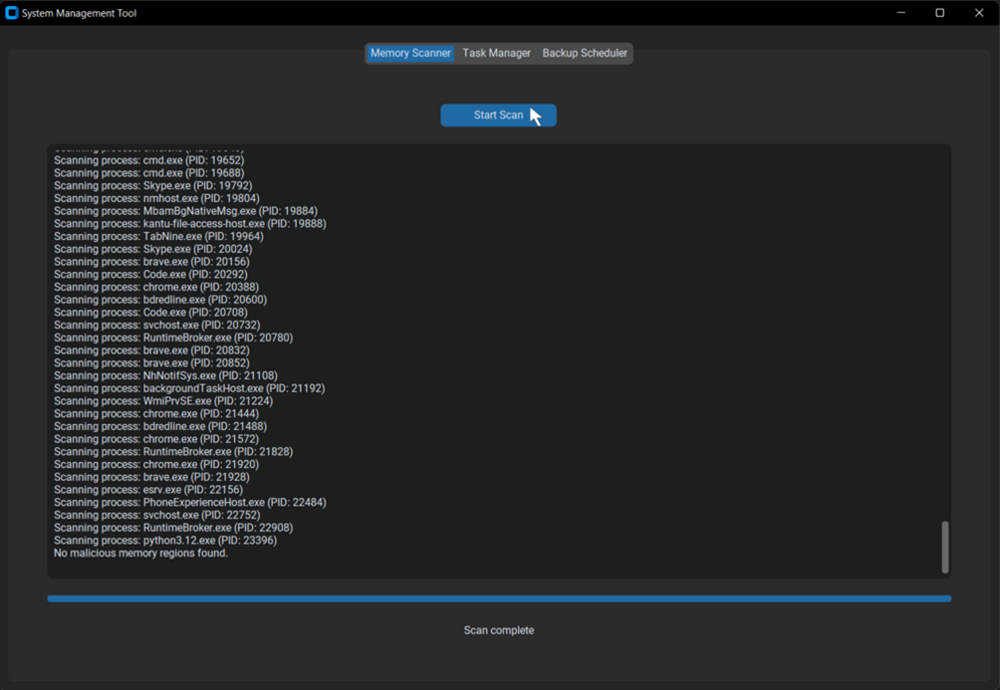
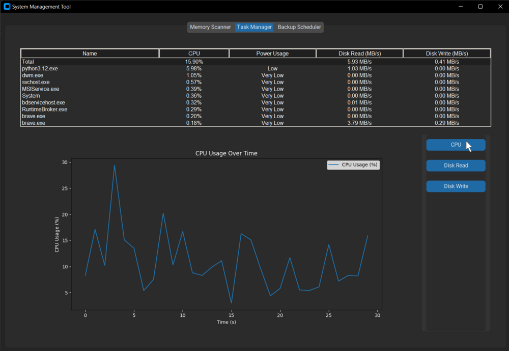
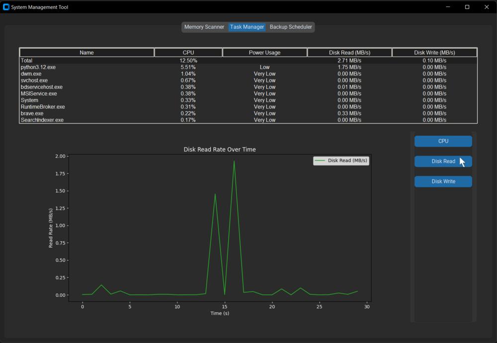
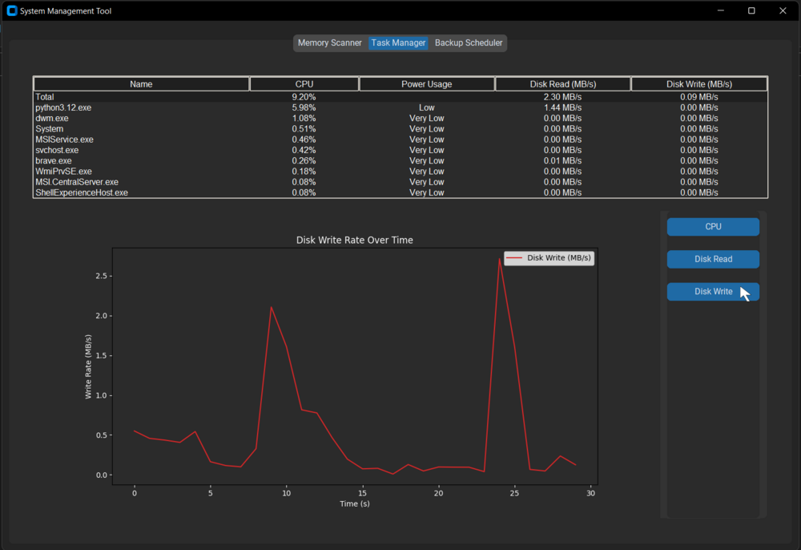
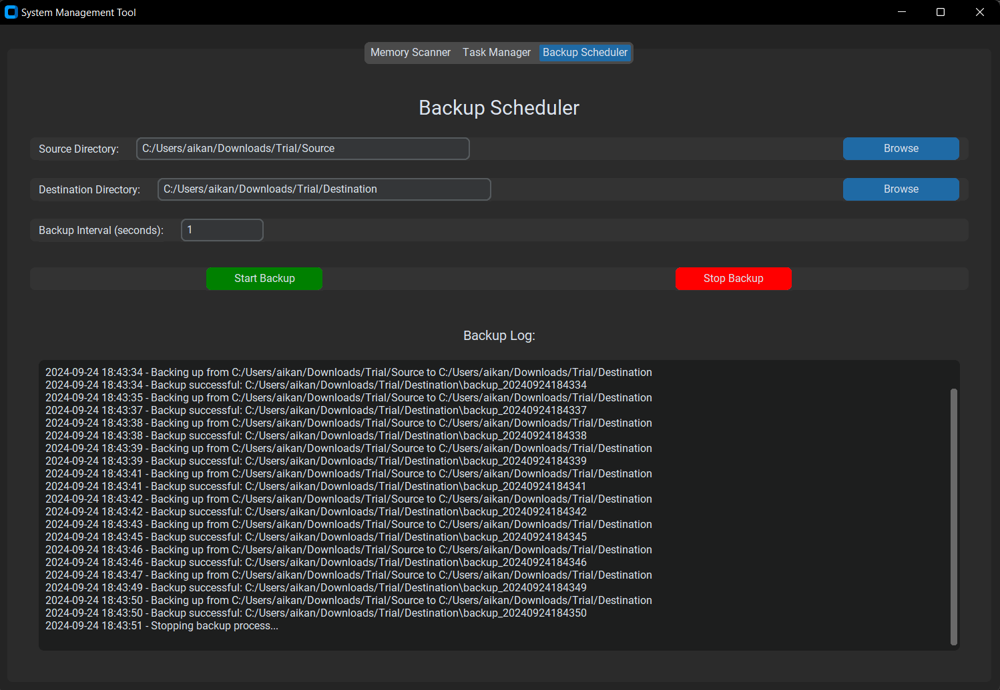
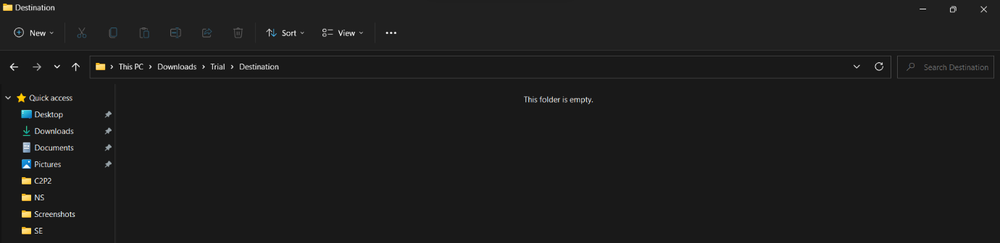
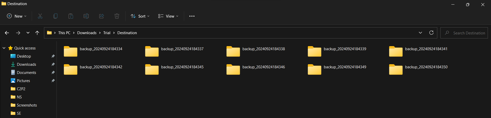

# System Management Tool

## Introduction
The System Management Tool is an integrated software solution designed to provide comprehensive system monitoring, management, and security capabilities for computer systems. This tool combines three essential modules: Memory Scanner, Task Manager, and Backup Scheduler, into a single, user-friendly graphical interface. By integrating these functionalities, the System Management Tool offers a holistic approach to system administration, performance optimization, and data protection.

## Features

### Memory Scanner
The Memory Scanner module is responsible for scanning the system's memory in real-time to detect and identify potential malicious code or security threats. It leverages hash-based detection to compare memory contents against a database of known malicious signatures.



### Task Manager
The Task Manager module provides detailed insights into system resource utilization, including CPU usage, disk I/O, and power consumption. It categorizes processes based on their impact on system performance, making it easier to identify and manage resource-intensive applications.

**CPU Usage Graph**


**Disk Read Usage Graph**


**Disk Write Usage Graph**


### Backup Scheduler
The Backup Scheduler module allows users to configure source and destination directories for automated backups. It implements a customizable backup interval system and manages backup rotations to maintain a specified number of recent backups while conserving storage space.


**Before Backup is Initiated**


**After Backup is Initiated**


## Objectives
1. **Enhance System Security**: Implement a Memory Scanner to detect and identify potential malicious code in system memory.
2. **Optimize Resource Utilization**: Provide a comprehensive Task Manager to monitor and manage system resources effectively.
3. **Ensure Data Protection**: Integrate a Backup Scheduler to automate and simplify the process of creating regular backups.
4. **Simplify System Administration**: Combine multiple functionalities into a single, intuitive interface for streamlined system management.
5. **Provide Real-time Insights**: Offer visual representations of system performance metrics for quick analysis and decision-making.

## Methodology
The System Management Tool employs a modular architecture, integrating three core components:

1. **Memory Scanner Module**: Utilizes process memory scanning techniques to identify potential security threats and implements hash-based detection.
2. **Task Manager Module**: Monitors system-wide and per-process CPU usage, disk I/O, and power consumption, and generates real-time graphs for visualizing system performance trends.
3. **Backup Scheduler Module**: Allows users to configure source and destination directories for backups, implements a customizable backup interval system, and manages backup rotations.

The integrated GUI, built using the customtkinter library, provides a modern, responsive, and tab-based layout for easy navigation between different modules.

## Outcomes
1. **Enhanced Security Posture**: Proactive detection of potential memory-based threats and real-time alerts for immediate response.
2. **Improved System Performance**: Detailed insights into resource utilization by individual processes and the ability to identify and manage resource-intensive applications.
3. **Robust Data Protection**: Automated, scheduled backups to prevent data loss and efficient management of backup history for optimal storage utilization.
4. **Streamlined System Administration**: Consolidated interface for multiple system management tasks and reduced complexity in monitoring and maintaining system health.
5. **Data-Driven Decision Making**: Real-time performance graphs for informed resource allocation decisions and comprehensive logging for tracking system activities and backup operations.
6. **User-Friendly Experience**: Intuitive, modern interface design for ease of use and customizable settings to adapt to specific user requirements.

The System Management Tool provides a comprehensive solution for maintaining optimal system health and performance while safeguarding against potential threats and data loss scenarios.

## System Management Tool

### Installation

1. Clone the repository and navigate to the project directory.
2. Install the required Python packages by running the following command:

   ```bash
   pip install -r requirements.txt

3. Run the Program using:
   ```bash
   GUI_Module.py
